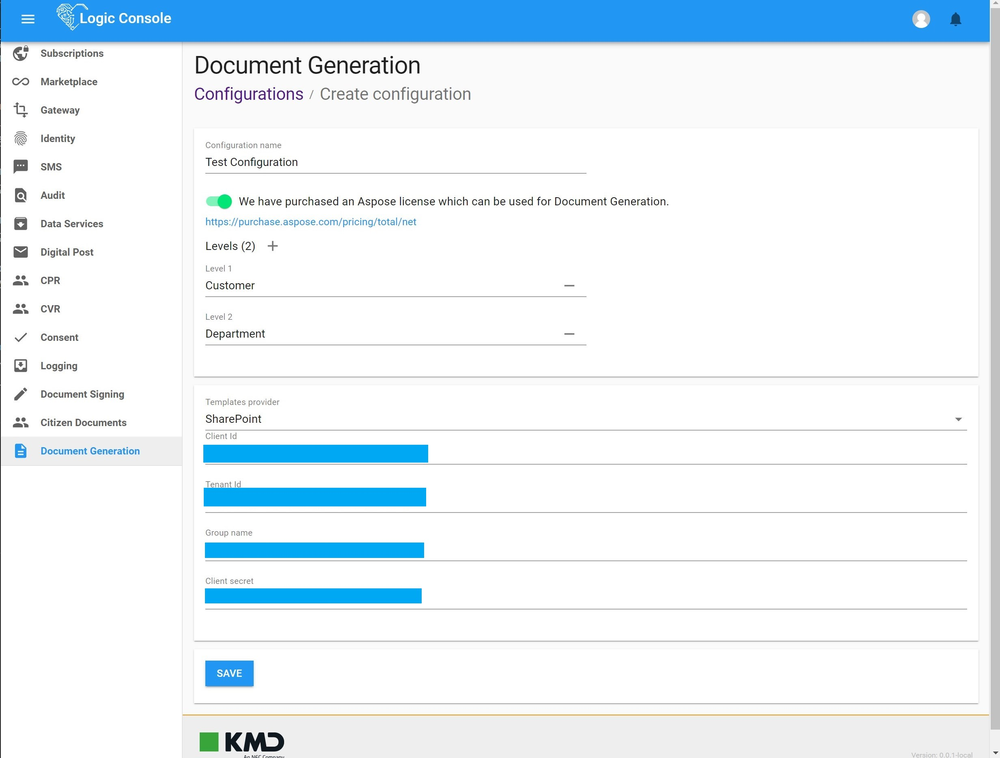

# KMD Logic Document Generation Configuration

To configure a Logic Document Generation environment you need to access [Logic Console](https://console.kmdlogic.io/).

## Accessing Logic Document Generation Configuration module

To access the Logic Document Generation Configuration module you will need to click on the menu labeled as `Document Generation` on the sidebar menu (highlighted in the image below).  

After doing that you will be presented with the `Logic Document Generation Configuration` module.

## Creating a Configuration environment

To create a Document Generation Configuration click on the `ADD CONFIGURATION` button at the top right corner of the screen.

You will be then presented with the following screen:

The screen is divided in two sections, the `Configuration Settings` and the `Master Storage Settings`, we will explain them below in detail.

### Configuration Settings

- Configuration name:  
_(Required)_ The configuration name, any non-empty string is valid.

- ASPOSE license switch:  
_(Required)_ In order to use `Logic Document Generation` your team needs to have a valid ASPOSE license. Toggle this switch on to acknowledge that.

- Levels:
_(Optional)_ `Logic Document Generation` allows you to consume templates stored in multiple storages, it uses a hierarchical organization where each _**level**_ down the hierarchy is able to override a template found on its parent _**level**_.  
By default this screen is pre-populated with two levels (Customer and Department), feel free to modify this to suit your needs.  

### Master Storage Settings

- Template provider:  
_(Required)_ The template storage provider where the master templates are stored.  
`Logic Document Generation` currently supports two storage providers: `SharePoint 365 Online` and `Azure Blob Storage`.

#### SharePoint settings

For `SharePoint Online`, `Logic Document Generation` requires an Azure App Registration with the following API permissions:

- Microsoft Graph
  - Files.ReadAll
  - Group.Read.All

Go to your organization Azure Portal and create one at [https://docs.microsoft.com/en-us/graph/auth-register-app-v2](https://docs.microsoft.com/en-us/graph/auth-register-app-v2).

You can read about how to set up an Azure App Registration that uses the Microsoft Graph API at [https://docs.microsoft.com/en-us/graph/auth-v2-service?view=graph-rest-1.0](https://docs.microsoft.com/en-us/graph/auth-v2-service?view=graph-rest-1.0).  

Once you have set the minimum permissions required by `Logic Document Generation`, you'll end up with something like this:  

Next, create a new client secret and copy its value which you will need later:

Finally, head over to the App Registration `Overview` module to copy its Client Id and Tenant Id:  

Once you have done all that, proceed to configure the SharePoint storage provider settings:  

- Client Id:  
_(Required)_ The Client Id from your App Registration.

- Tenant Id:  
_(Required)_ The Tenant Id from your App Registration.

- Group Name:  
_(Required)_ The SharePoint group name where the templates are stored.

- Client Secret:  
_(Required)_ The Client Secret from your App Registration.

#### Azure Blob Storage settings

You'll need an Azure Blob Storage resource to use this provider.  

To create an Azure Blob Storage resource please follow the guide located in [https://docs.microsoft.com/en-us/azure/storage/common/storage-account-create](https://docs.microsoft.com/en-us/azure/storage/common/storage-account-create).

Once you have done that, you'll need to take note of its connection string, you can do that by following guide: [https://docs.microsoft.com/en-us/azure/storage/common/storage-account-keys-manage#view-access-keys-and-connection-string](https://docs.microsoft.com/en-us/azure/storage/common/storage-account-keys-manage#view-access-keys-and-connection-string).  

Finally, fill out the Azure Blob Storage provider settings.  

- Container:  
_(Required)_ Your Azure Blob Storage container name.

- Connection:  
_(Required)_ Your Azure Blob Storage connection string.  

- Blob prefix:  
_(Optional)_ Your Azure Blob Storage blob prefix.

### Persisting your changes
After filling out the details for your configuration and its master storage the `Save` button underneath will get enabled, like so:

Just click the `Save` button and you'll be all set.

## Configuration entries

In the screenshot above, we can see a section called `Configuration Entries`. 

This grid list all the entries in our hierarchy, starting from the Configuration Master Entry, like the following grid filled with a couple of entries (most of them misconfigured for demo purposes):

The grid has the following columns:

- Name:  
The name of the entry.

- Level:  
The level of the entry in the hierarchy.

- Storage:  
The type of storage used by the entry.

- Path:
The hierarchy path of the entry in the hierarchy.

- Status:  
Indicates whether the connection to the configured storage can be done successfully or not.  
Hovering the pointer over the status badge will provide further details about the connection status when possible.  

- Actions:

  - Edit entry (pencil icon):  
  Allows you to edit the configuration entry.  
  It will open a pop-up dialog like so:  

  - Add child entry (plus icon):  
  Adds a child entry to the configuration entry.  
  It will open a pop-up dialog like so:  
  

  - Remove entry (trash icon):  
  Removes (after prompting the user) the configuration entry. 
  

## Removing a Logic Document Generation Configuration

In order to remove a `Logic Document Generation Configuration`, click on the menu labeled as `Document Generation` on the sidebar menu (highlighted in the image below).  

You'll now see a grid with your configuration in it, like so:  

Click the remove button (trash icon), a prompt will be displayed like so:

After clicking `Remove`, the configuration will be removed from your Logic subscription.