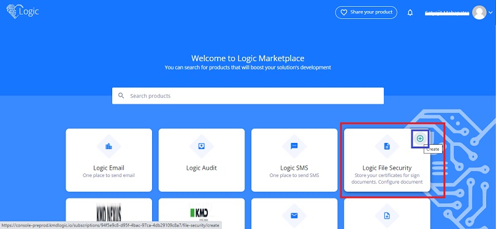
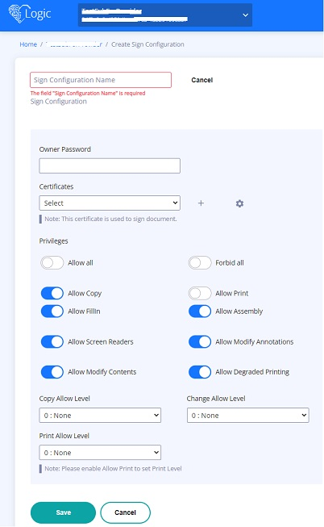

# Document Generation with File security

As you know Document generation service helps in generating documents based on templates. In this part we will focus on the security of those documents.

## Prerequisites

1. You are a KMD User
2. Verify `cURL` command line tool is available in your system by executing `curl --help` in command prompt.
3. If you don't have `cURL` then please download the package from [here](https://curl.se/dlwiz/?type=bin) for your respective OS ([Refer](https://help.ubidots.com/en/articles/2165289-learn-how-to-install-run-curl-on-windows-macosx-linux) for help in how to install)
4. You should have either a Share point or Azure storage account to store templates.
5. You have gone through the [Docgen-Workshop.md](./Docgen-Workshop.md) file.
6. You have existing subscription and document generation configuration in Logic. Please use the same for this workshop. If not you can go through the document mentioned in previous step.

How to secure files which we generate in document generation? We have another service in Logic known as `Logic File Security` which is used for this purpose. We have an integration between Logic Document Generation and File Security so that document generation can leverage file security service. Using file security we can do the following
1. Sign your document with certificates.
2. Set privileges on how the document can be used. E.g. you can allow or restrict the print of the document etc.

Below are the overview of steps which we are going to follow for this workshop.

1. Create a configuration in Logic File Security, we call it as `SignConfiguration`
2. Use the sign configuration while requesting for document generation

## Create Sign Configuration

1. Log in to [Logic Console](https://console-preprod.kmdlogic.io/) and go to `Marketplace`. As mentioned in the `Docgen-Workshop.md` file, if you are a first time user you will see Marketplace after logging in. If you already have a subscription, you will land in `Resource Overview` and click on `Create new resource` to navigate to Marketplace.

2. Search for file security in marketplace and you can see file security product tile. Click on the `+` icon which appears on the tile when you hover mouse over the product tile. It will take you to the configuration creation page.   

    

3. In sign configuration creation page the followings can be configured.

    <ins>Owner Password</ins> - It is a mandatory field. It can be used to override the privileges of the document once it is generated.

    <ins>Certificates</ins> - You can upload certificates which can be used to sign the file. It is an optional field.

    <ins>Privileges</ins> - There are different privileges that can be set. When the document will be generated it will have only those privileges which are configured for the sign configuration. For workshop puprose you can select `Allow all` which will allow all privileges and then turn off `Allow Print`. Refer to the screenshot below. Once document is generated we shall veriy that print option is not available for it. Click on `Save` to create the configuration and make a note of it.

    Currently sign configuration supports only `Pdf` type documents.    

    

## Document generation using cURL command

Please refer to the previous workshop documentation [Document generation using cURL command](./Docgen-Workshop#document-generation-using-cURL-command)

### Document generation API request structure

We will pass an additional parameter `SignConfigurationId` in the document generation API request.
```
{
"configurationId": "{Provide the Document generation configuration id}",
"hierarchyPath": "\\",
"templateId": "word-template.docx",
"language": "en",
"documentFormat": "Pdf",
"mergeData": {"FirstName":"{Provide First name}","LastName": "{Provide Last name}"},
"callbackUrl": "{A Url to which Logic will send notification about request status }",
"debug": true,
"signConfigurationId":"{Provide the Sign configuration Id}"
}
```
    


