# Document Generation Workshop

Document generation service helps in generating documents for well-defined business scenarios using templates that their customers can easily manage. 

## Prerequisites

1. You are a KMD User
2. Verify `cURL` command line tool is available in your system by executing `curl --help` in command prompt.
3. If you don't have `cURL` then please download the package from [here](https://curl.se/dlwiz/?type=bin) for your respective OS ([Refer](https://help.ubidots.com/en/articles/2165289-learn-how-to-install-run-curl-on-windows-macosx-linux) for help in how to install)
4. You should have either a Share point or Azure storage account to store templates. In this workshop, we will be using Azure storage. We will provide you a temporary Azure blob container to be used as template storage during the workshop.

## Flow

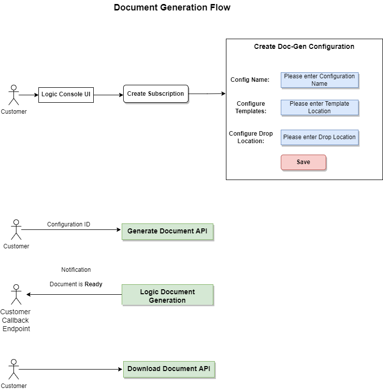

## Step-by-step guide

Document generation service is hosted on Logic platform along with many other services. To use Document generation service on Logic platform you need to do the following

1. Create a subscription in Logic platform by logging in to [Logic Console](https://console.kmdlogic.io/)
2. Create a Document generation configuration.
3. Create client credentials for an authorized access to Document generation service.
4. Use the above created `Subscription Id`, `Configuration Id` and `Client Credentials` while accessing the Document Generation APIs to request for a document.
5. Document generation APIs can be accessed using `cURL` commands or through a [dotnet client](https://www.nuget.org/packages/Kmd.Logic.DocumentGeneration.Client). Also refer to our [Github](https://github.com/kmdlogic/kmd-logic-document-generation-client) for more information.
6. Once document is generated you will receive a notification from Logic about the status of your request.
7. There are APIs available in Document geneation to get the URL where the document is generated and uploaded to.

Below are the detailed steps which will help you in getting started with Logic Document Generation.
## Set a Template storage account

Before getting into Logic Console and Document Generation configuration, let's first upload [this](./template/word-template.docx) simple template to a Share point or an Azure blob storage. This storage will be used further while creating document generation configuration.

## Create Subscription & Document generation Configuration

1. Login to [Logic Console](https://console-preprod.kmdlogic.io/) using your KMD credentials. Select `KMD ADFS`. Console is our front end to create configurations for different services on Logic. These configurations will be used to consume the APIs of respective services. To use the services on Logic you also need to create a subscription.

2. After logging in to Console you can either see `Marketplace` or `Resource Overview` page depending whether you have a subscription in Console or not. 

3. If you already have a subscription you will land in `Resource Overview` page. If you click on `Creat new resource` you will navigate to `Marketplace`.

    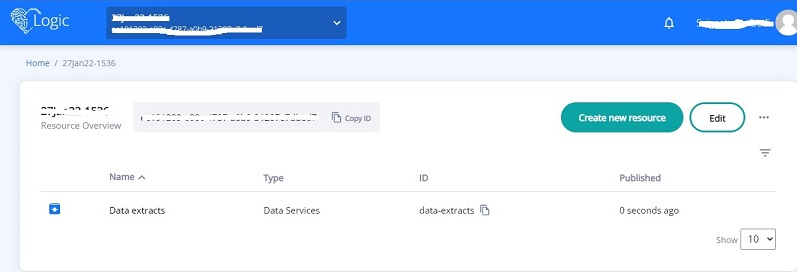

4. If you are a first time user you will directly land in `Marketplace`. Here you can see all the products/services available in Logic platform. Search for `Logic Document Generation`. You will see the service. Select the service to know more about it.

    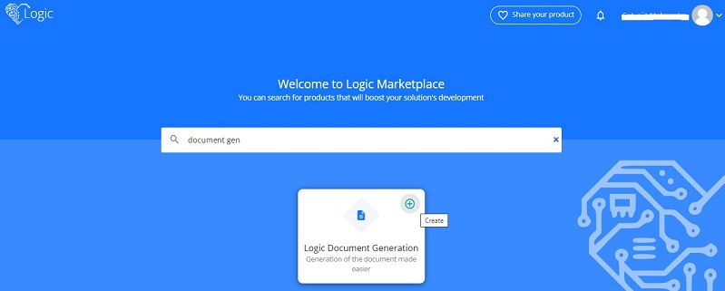

5. From `Marketplace` once you select the service you can see various details like Overview, API Reference etc. To create a configuration click on `Create`.

    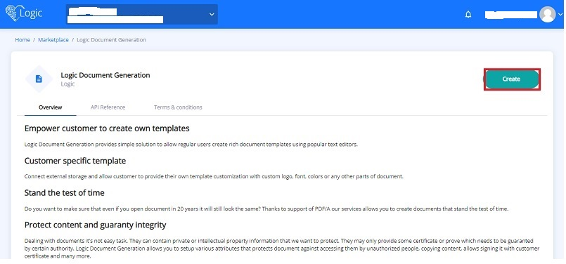

6. If you are a new user then you will be enforced to create a subscription first. Below is screenshot for reference.

    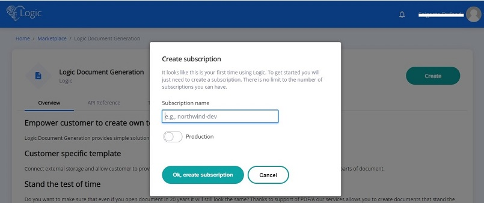

7. After creating subscripton you will landup in the configuration create page.

    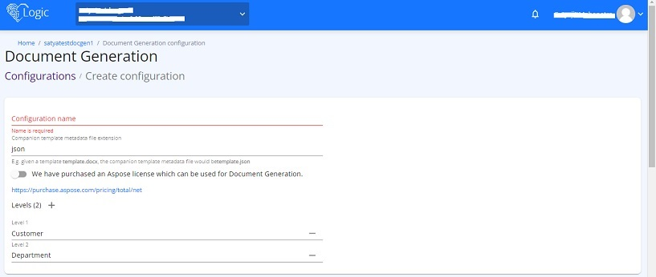


8. Each configuration has 3 sections such as `Configuration settings`, `Template storage settings` and `Output storage settings`. Each of the section is explained below.

9. ### Configuration settings
    Configuration values like Name, template metadata file extension and levels are defined here. Template metadata files are used to provide additional information about a template. [Refer](../Templates/TemplateMetadata.md) for more information.

    Levels are used to define the hierarchy in a configuration. We can have template files at each level which will override the parent template files during document generation. Hierarchies are particularly useful in scenarios where same configuration is used by multiple departments to generate documents using templates at their respective level. For each level separate template storage configurations are defined which is explained in the next section `Template storage settings`. By default it has 2 levels `Cusotmer` and `Department` which can be removed and you can add your level. You can also choose not to have any level. For workshop puprose let's keep the the default values.

10. ### Template storage settings
    Document generation service uses templates to generate documents. As part of configuration creation, the storage where templates are available are configured. Currently Logic supports two types storage, `Share point` and `Azure blob`. Please refer to the screenshot below.

    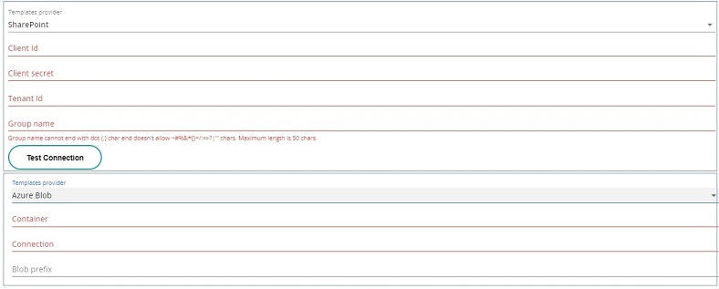

    You can use the storage where you have uploaded the template file earlier.

    The template storage that is configured during creation of document generation configuration becomes the root level template storage. Once the configuration is created, new entries can be added under this root level which can further signify the template storage for levels defined during configuration creation. These entries are known as [Configuration entries](#configuration-entries)

11. ### Output storage settings
    The generated documents are stored in this storage and there are APIs available to get the the url to the storage. This storage can be owned by Logic or the user. Default it is Logic storage and the document will be available for 24 hrs. You can provide your storage configuration where the document will be uploaded by the document generation service. Currently only Azure blob storage is supported as Output storage. For the purpose of workshop you can use the default setting.

    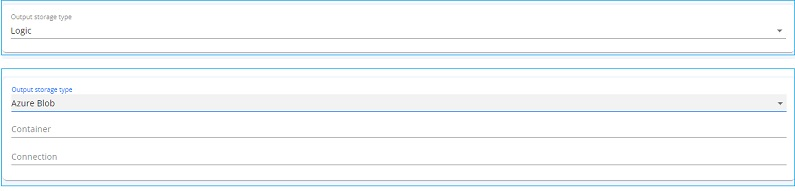

12. After providing all the inputs, click on `Save` to create the configuration. After configuration creation you can see the `Configuration ID` or `Resource ID` which will be used while accessing the APIs. You can also see any client credentials created for that subscription.

    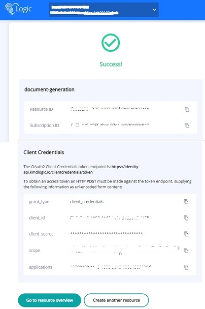

## Create Client credentials

13. Next we will be creating client credentials in the Console using the same subscription. These will later be used while accessing the document generation APIs.

14. Click on the `Logic` heart icon on top left of the page. It will take you to the `Resource overview` page.

    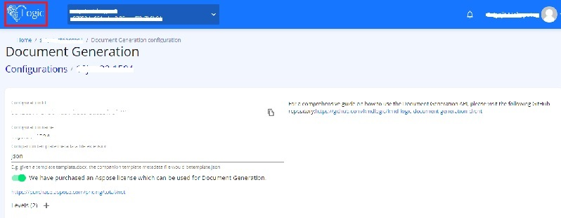

15. In the `Resource Overview` page, click on the ellipsis and select `Client credentials`

    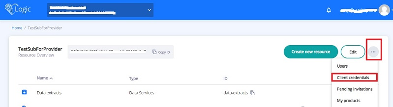

18. You will be redicted to the Client credentials page where you can see the list of client credentials created. As of now you will not see any existing records. Click on `Add new`.

    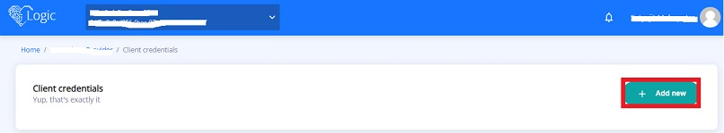

19. Provide a `Display name` and click on `Create` in the pop-up window.

    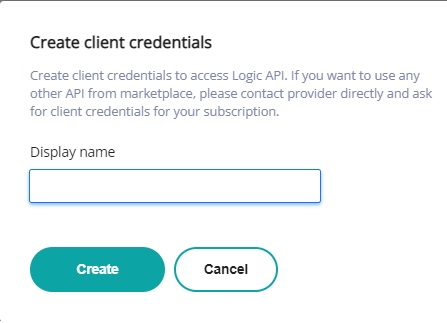

20. After the creation you can see the record in the same page. Expand the record to view more details. Properties `client_id`, `client_secret` and `scope` will be used further to access the Document generation APIs. Copy these values to a notepad for further use.

    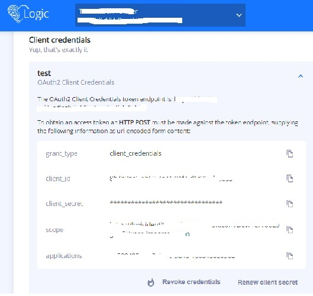
## Document generation API request structure

21. Next we will start using the Document generation API to send a request. Let's have a look how a document generation request will be.
```
{
"configurationId": "{Provide the Document generation configuration id}",
"hierarchyPath": "\\",
"templateId": "word-template.docx",
"language": "en",
"documentFormat": "Pdf",
"mergeData": {"FirstName":"{Provide First name}","LastName": "{Provide Last name}"},
"callbackUrl": "{A Url to which Logic will send notification about request status }",
"debug": true
}
```
`configurationId` - Use the configuration id/resource id created above

`hierarchyPath` - This represents the path of the Configuration entry (Root or child entries). For this workshop we will start with Root or Master entry for which path is `\\`. For more information please refer [this](../HierarchyPath.md)

`templateId` - This is the template file name which is uploaded to the Template storage setting

`language` - It specifies a language code in ISO 639-1 format (eg. en, da). This denotes the language used in the template. If you have same template with different language then you can use that template with an extension of the language code. E.g. `word-template.docx` template in Danish would be `word-template.da`.

`documentFormat` - Format of the document to be generated. Other supported types are txt, Rtf, Doc, Docx etc

`mergeData` - Data provided here will be used in the generated document. It should have the placholders e.g. `FirstName`, `LastName` which are used in the template and respective values.

`callbackUrl` - When document generation process is complete or failed you will receive a notification through this Url. For workshop we will mock this by using a simple url provider [Webhook](https://webhook.site/c9f0453d-491c-49eb-a39a-d73d429d9cbb). Navigate to the site and use `Copy` to get the callback url. Screenshot is below.
        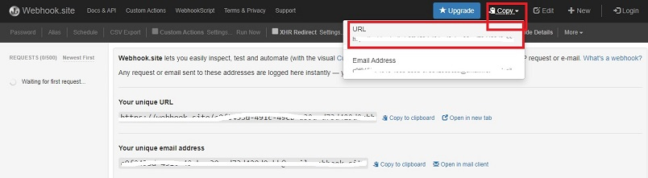

Form the request body in the format mentioned above and keep it for further use.
## Document generation using cURL command

We will use `cURL` commands to hit the APIs. 

i)  <ins>Get bearer token</ins> - In first step we will hit our `Logic Identity` [API](https://identity-api.kmdlogic.io/clientCredentials/token?issuer=b2clogin.com) to get bearer token.

ii) <ins>Request Document generation</ins> - Then in second step we will use this bearer token and hit document generation API to request to generate document. In response we will get the `RequestId`.

iii) <ins>Get Url where document is uploaded</ins> - And finally after requesting for document generation, we shall be notified through our call back Url (Here the webhook). Once we are notified, we will hit another document generation API using the request id to get the url where the document is uploaded.

### Request bearer token

Below is the command. Here you have to use the client_id and client_secret noted earlier.


```
curl -X "POST" "https://identity-api.kmdlogic.io/clientCredentials/token?issuer=b2clogin.com" -H "accept: application/json" -H "Content-Type: application/x-www-form-urlencoded" -d "grant_type=client_credentials&client_id={Your_client_id}&client_secret={Your_client_secret}&scope={Your_scope}"

```

You will get the `Bearer` token in response. Copy the value of `access_token` to a notepad. It will be valid for 60 minutes.
### Request for a document generation

Next is to hit document generation API to request for a document generation using the request body which have been formed in earlier step. For the workshop we are going to use the Logic `Preprod` environment.

<ins>Powershell<ins>

```

curl -X POST "https://kmd-logic-preprod-weu-apim.azure-api.net/document-generation/v2/subscriptions/{Logic_Subscription_Id}/document-generation/requests" -H "accept: application/json" -H "Authorization: bearer {Access_token}" -H "Content-Type: application/json-patch+json" -d '{\"configurationId\":\"{Document_Generation_ConfigurationId}\",\"hierarchyPath\":\"\\\\\",\"templateId\":\"word-template.docx\",\"language\":\"en\",\"documentFormat\":\"Pdf\",\"mergeData\":{\"FirstName\":\"{Request_Value}\",\"LastName\":\"{Request_Value}\"},\"callbackUrl\":\"{Webhook_Url_Value}\",\"debug\":true}'

```

<ins>Bash<ins>

```

curl -X POST "https://kmd-logic-preprod-weu-apim.azure-api.net/document-generation/v2/subscriptions/{Logic_Subscription_Id}/document-generation/requests" -H "accept: application/json" -H "Authorization: bearer {Access_token}" -H "Content-Type: application/json-patch+json" -d '{"configurationId":"{Document_Generation_ConfigurationId}","hierarchyPath":"\\\\","templateId":"word-template.docx","language":"en","documentFormat":"Pdf","mergeData":{"FirstName":"{Request_Value}","LastName":"{Request_Value}"},"callbackUrl":"{Webhook_Url_Value}","debug":true}'

```

<ins>Cmd<ins>

```

curl -X POST "https://kmd-logic-preprod-weu-apim.azure-api.net/document-generation/v2/subscriptions/{Logic_Subscription_Id}/document-generation/requests" -H "accept: application/json" -H "Authorization: bearer {Access_token}" -H "Content-Type: application/json-patch+json" -d "{\"configurationId\":\"{Document_Generation_ConfigurationId}\",\"hierarchyPath\":\"\\\\\",\"templateId\":\"word-template.docx\",\"language\":\"en\",\"documentFormat\":\"Pdf\",\"mergeData\":{\"FirstName\":\"{Request_Value}\",\"LastName\":\"{Request_Value}\"},\"callbackUrl\":\"{Webhook_Url_Value}\",\"debug\":true}"

```

The response of the above request will give you the request details. Make a note of the `id` from the response. That is the `RequestId`.
### Get path to the document

After getting the response from document generation request API, in a few moments you should be able to see a notification in your webhook url in browser. In the notification you can see the request id which you can correlate or match with the request id from the API response. Also you can find the status of the request. It should be `Completed`. Please refer to the below screenshot.

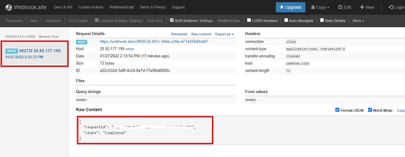

Now you can hit another document generation API which will give you the path where document has been uploaded.

```
curl -X GET "https://kmd-logic-preprod-weu-apim.azure-api.net/document-generation/v2/subscriptions/{Logic_Subscription_Id}/document-generation/requests/{Request_Id}/download" -H "accept: application/json" -H "Authorization: bearer {Access_token}"

```

From the response get the value of `uri` and open it in browser. Your document should be downloaded.
## Configuration entries
Once a configuration is created you can view the template storage defined at `Root` level whose storage setting was provided during configuration creation. This becomes the `Master`. Screenshot below.

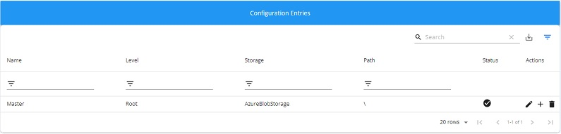
    
You can add further child entries to the Root or Master entry. These child entries will correspond to your levels' template storage setting. E.g. If your configuration has two levels such as `city` and `school` where the hierarchy is root->city->school, you can add one or more child entries to Master which will correspond to the city level. Each of those entries will have their own Template storage setting (Shared point or Azure blob). You can further add one or more child entries to city which will correspond to school level template storage setting. Please refer to the screenshot below.

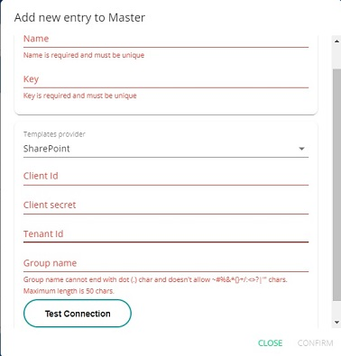

While adding the child entries there are two more fields `Name` and `Key` for which values have to be provided. Name specfies the name of the entry. For Root entry which is added default during configuration creation, the name is Master. Key signifies the logical path in the hierarchy. For Root it is `\`. This path value is **important** as it is used in the body of API request while requesting for document generation.

Consider the above example of levels city and school. Say we have one entry for city under Master with Name as `Copenhagen` and key as `\copenhagen` and one entry for school under city Copenhagen with Name as `Copenhagen International School` and key as `cis`. If you want to generate document for a template for Copenhagen entry, request should have path as `\copenhagen`. For school under Copenhagen request path should be `\copenhagen\cis` and if you want to generate document using template at root, path should be `\\`. Below is the screenshot showing the Configuration entries for the example.

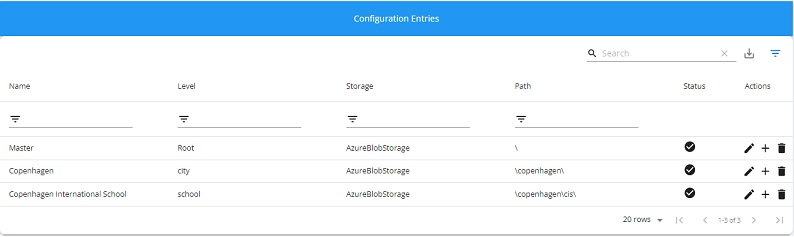


